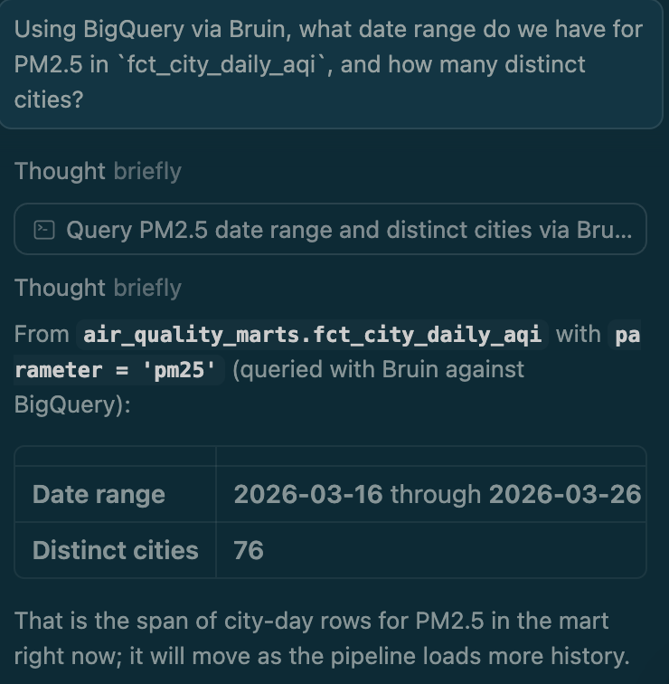
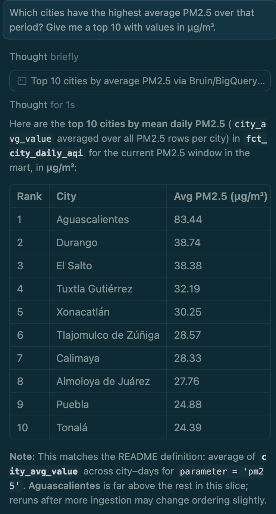
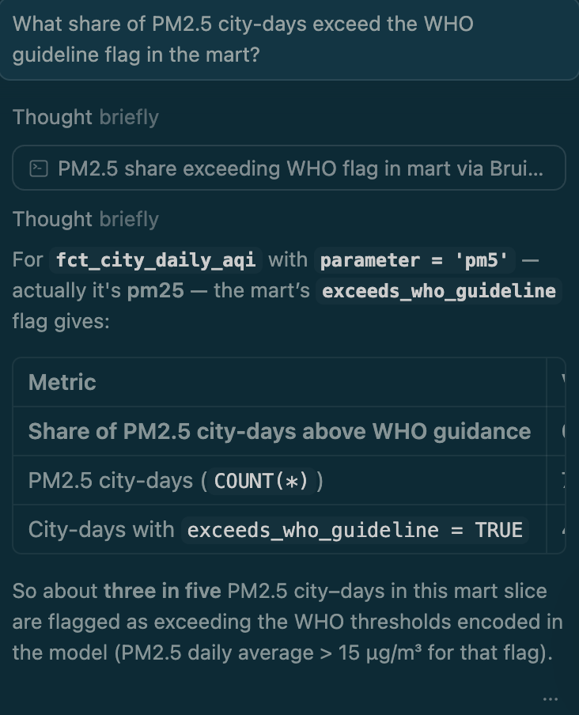
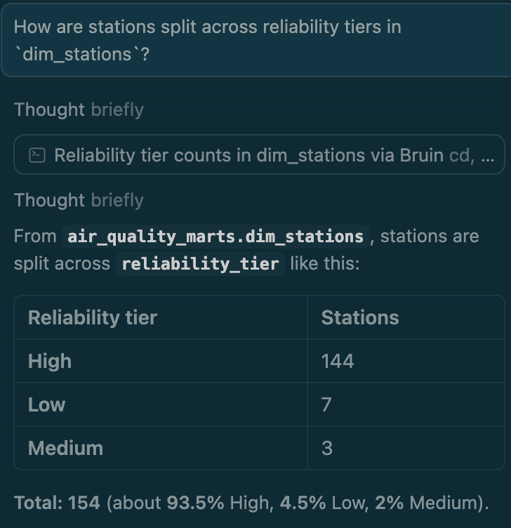
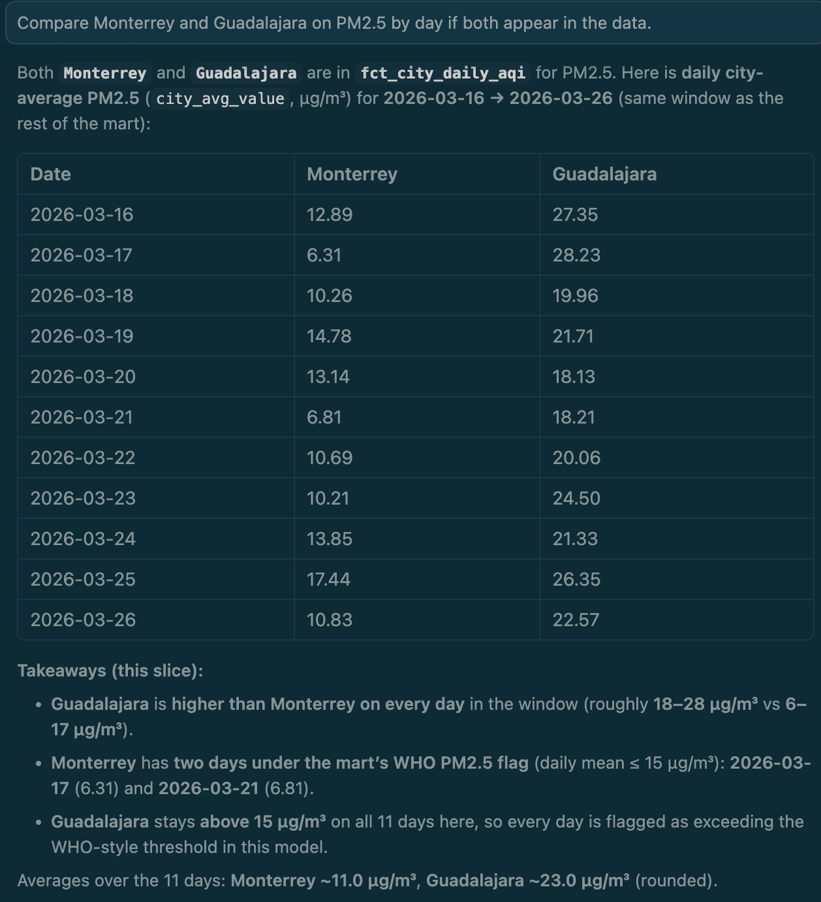

# Mexico Air Quality Monitoring Pipeline — Bruin

## Problem Description

Air pollution is one of the leading causes of premature death in Mexico, with northern industrial cities like Chihuahua, Juárez, and Monterrey regularly exceeding WHO guideline levels for particulate matter and gaseous pollutants. Despite government monitoring stations collecting hourly readings across the country, this data is scattered across raw archives and APIs with inconsistent formats, units, and coverage gaps — making it difficult for researchers, journalists, or policymakers to get a clear picture of air quality trends.

This project builds an end-to-end data pipeline that:

1. **Ingests** air quality data from 300 monitoring stations across 121 Mexican cities, covering 12 pollutant types (PM2.5, PM10, O3, NO2, CO, SO2, NO, NOx, PM1, temperature, humidity, particle counts).
2. **Cleans and normalizes** the data — deduplicating readings, converting inconsistent measurement units (ppm → µg/m³), and filtering sensor errors.
3. **Transforms** the data into analytics-ready tables: a city-level daily Air Quality Index (AQI) fact table with WHO guideline exceedance flags, and a station reliability dimension.
4. **Serves** an interactive Looker Studio dashboard showing pollution hotspots on a map, worst-city rankings, and daily trend lines.

The pipeline supports both **batch** ingestion (historical data from the OpenAQ S3 archive) and **streaming** ingestion (near-real-time readings via Kafka/Redpanda), demonstrating both patterns in a single project.

**Data source:** [OpenAQ](https://openaq.org) — the world's largest open-source air quality data platform, aggregating government-grade measurements from 130+ countries.

---

## Architecture

```
┌─────────────────────────────────────────────────────────────────┐
│                          SOURCES                                │
│  OpenAQ S3 Archive ──── Batch (CSV.gz) ────┐                    │
│  OpenAQ API v3     ── Streaming (JSON) ──┐ │                    │
└──────────────────────────────────────────┼─┼────────────────────┘
                                           │ │
                      ┌────────────────────┘ │
                      │    ┌─────────────────┘
                      ▼    ▼
┌─────────────────────────────────────────────────────────────────┐
│                     INGESTION                                   │
│                                                                 │
│  Batch:     raw_locations.py ─── OpenAQ API → BigQuery          │
│             raw_measurements.py ─ S3 CSV.gz → BigQuery          │
│                                                                 │
│  Streaming: producer.py ─── OpenAQ API → Redpanda               │
│             consumer.py ─── Redpanda → BigQuery                 │
└────────────────────────────────┬────────────────────────────────┘
                                 ▼
┌─────────────────────────────────────────────────────────────────┐
│               TRANSFORMATION (Bruin SQL Assets)                 │
│                                                                 │
│  air_quality_raw          air_quality_staging     air_quality_marts
│  ├── locations            ├── measurements        ├── fct_city_daily_aqi
│  ├── measurements         │   (clean, normalize,  └── dim_stations
│  └── measurements_stream  │    deduplicate)
│                           │
│  Quality checks: 17 passing (not_null, unique, non_negative,    │
│                   accepted_values, positive)                    │
└────────────────────────────────┬────────────────────────────────┘
                                 ▼
┌─────────────────────────────────────────────────────────────────┐
│                     ORCHESTRATION                               │
│  Bruin CLI — built-in DAG resolution from `depends:` metadata   │
│  Pipeline schedule: daily                                       │
│  Assets execute in order: locations → measurements → staging    │
│                           → fct_city_daily_aqi + dim_stations   │
└────────────────────────────────┬────────────────────────────────┘
                                 ▼
┌─────────────────────────────────────────────────────────────────┐
│                      DASHBOARD                                  │
│  Looker Studio (connected to BigQuery marts)                    │
│  Tiles: KPI scorecards, bubble map, bar chart, time series      │
└────────────────────────────────┬────────────────────────────────┘
                                 ▼
┌─────────────────────────────────────────────────────────────────┐
│              ANALYSIS (AI DATA ANALYST ON BIGQUERY)             │
│  Bruin MCP + IDE: prompts → `bruin query` on BigQuery → answers  │
│  Same `air_quality_marts` tables as the dashboard               │
└─────────────────────────────────────────────────────────────────┘
```

---

## Technology Stack


| Layer                   | Technology              | Purpose                                                                                                                       |
| ----------------------- | ----------------------- | ----------------------------------------------------------------------------------------------------------------------------- |
| Infrastructure as Code  | Terraform               | Provision GCS bucket + 3 BigQuery datasets                                                                                    |
| Containerization        | Docker Compose          | Run Redpanda (Kafka-compatible broker) + Console                                                                              |
| Data Ingestion (batch)  | Python + Bruin          | Download CSV.gz from OpenAQ S3, load to BigQuery                                                                              |
| Data Ingestion (stream) | Kafka (Redpanda)        | Producer polls OpenAQ API, consumer writes to BigQuery                                                                        |
| Data Warehouse          | Google BigQuery         | Partitioned by date, clustered by parameter                                                                                   |
| Transformations         | Bruin SQL assets        | Staging (clean + normalize) → Marts (analytics)                                                                               |
| Data Quality            | Bruin built-in checks   | 17 checks: not_null, unique, non_negative, accepted_values                                                                    |
| Orchestration           | Bruin CLI               | DAG resolution, scheduling, dependency management                                                                             |
| Dashboard               | Looker Studio           | 4-tile interactive dashboard                                                                                                  |
| Analysis                | Bruin MCP + IDE prompts | Ask questions in plain language; answers from live BigQuery via Bruin (see [Analysis](#analysis-ai-data-analyst-on-bigquery)) |


---

## Cloud & Infrastructure as Code

The project runs entirely on **Google Cloud Platform**. All cloud resources are provisioned and managed with **Terraform**:

**Terraform-managed resources (`infrastructure/terraform/main.tf`):**

- **GCS Bucket** (`dtc-de-course-454704-air-quality-raw`): Raw data landing zone with lifecycle rules (auto-transition to Nearline after 90 days) and versioning enabled.
- **BigQuery Dataset** `air_quality_raw`: Raw ingested data from batch and streaming sources.
- **BigQuery Dataset** `air_quality_staging`: Cleaned, deduplicated, unit-normalized data.
- **BigQuery Dataset** `air_quality_marts`: Analytics-ready tables for the dashboard.

Existing resources were imported into Terraform state using `terraform import`, ensuring the IaC reflects the actual cloud environment.

---

## Data Ingestion

### Batch Ingestion

Two Python assets handle batch ingestion, orchestrated by Bruin's dependency system:

**Asset 1: `air_quality_raw.locations`** (Python)

- Fetches all 300 Mexico monitoring station metadata from the OpenAQ v3 API.
- Loads station ID, name, locality, coordinates, sensor list, and sensor count into BigQuery.
- Quality checks: `not_null` on location_id and name, `unique` on location_id.

**Asset 2: `air_quality_raw.measurements`** (Python)

- Reads the list of Mexico location IDs from BigQuery (depends on Asset 1).
- For each location, downloads daily CSV.gz files from the OpenAQ S3 archive (`s3://openaq-data-archive/records/csv.gz/locationid={id}/year={year}/month={month}/`).
- Parses the 9-column CSV schema (location_id, sensors_id, location, datetime, lat, lon, parameter, units, value).
- **Idempotent**: Uses a delete-then-append strategy — deletes existing rows in the target date range before loading, ensuring re-runs produce the same result without duplicates.
- Quality checks: `not_null` on location_id, parameter, and value.

### Streaming Ingestion

**Producer** (`producer.py`):

- Polls the OpenAQ v3 API endpoint `/v3/locations/{id}/latest` for each Mexico station.
- Publishes measurement records as JSON messages to the `openaq-measurements` Redpanda topic (3 partitions).
- Message key: `{location_id}_{parameter}` for partition affinity.
- Configurable poll interval and location count.

**Consumer** (`consumer.py`):

- Consumes from the `openaq-measurements` topic.
- Micro-batches records and flushes to BigQuery (`air_quality_raw.measurements_stream`) every N seconds or M records.
- The target table is partitioned by `datetime_utc` (DAY) and clustered by `parameter`.
- Handles backpressure via configurable batch size and flush interval.

**Infrastructure**: Redpanda runs via Docker Compose with a web console for debugging.

---

## Data Warehouse

BigQuery is organized in three layers:

### `air_quality_raw` (Raw Layer)


| Table                 | Source         | Rows     | Description                 |
| --------------------- | -------------- | -------- | --------------------------- |
| `locations`           | OpenAQ API     | 300      | Station metadata for Mexico |
| `measurements`        | S3 batch       | 192,708+ | Historical sensor readings  |
| `measurements_stream` | Kafka consumer | Ongoing  | Real-time sensor readings   |


### `air_quality_staging` (Staging Layer)


| Table          | Description                                                                        |
| -------------- | ---------------------------------------------------------------------------------- |
| `measurements` | Cleaned, deduplicated, unit-normalized readings from both batch and stream sources |


**Optimizations applied:**

- **Deduplication**: `ROW_NUMBER()` window function partitioned by `(location_id, parameter, datetime)` keeps only the latest ingestion per reading.
- **Unit normalization**: Converts ppm → µg/m³ for all gaseous pollutants using standard conversion factors (CO: ×1145, NO2: ×1880, SO2: ×2620, O3: ×1960, NO: ×1230, NOx: ×1880).
- **Outlier filtering**: Removes negative values (sensor errors) and extreme outliers (value ≥ 10,000).
- **Time dimension extraction**: Pre-computes `measurement_date`, `measurement_hour`, and `day_of_week` for efficient downstream queries.

### `air_quality_marts` (Marts Layer)

`**fct_city_daily_aqi`** — City-level daily air quality metrics:

- Grain: one row per city × date × parameter.
- Aggregates: city average, min, max, station count, reading count, coverage percentage.
- WHO AQI categories for PM2.5 and PM10 (Good / Moderate / Unhealthy for Sensitive Groups / Unhealthy / Very Unhealthy / Hazardous).
- Boolean flag `exceeds_who_guideline` for PM2.5, PM10, NO2, and O3.
- Includes city centroid coordinates for map visualization.

`**dim_stations`** — Station dimension with reliability scoring:

- Grain: one row per station.
- Activity metrics: first/last reading date, active days, total readings.
- Reliability tier (High/Medium/Low) based on uptime percentage.
- Parameters observed and sensor count.

---

## Transformations

Transformations are implemented as **Bruin SQL assets** with built-in quality checks declared in the asset metadata. This is Bruin's equivalent of dbt models + tests in a single file.

**Staging asset** (`stg_measurements.sql`):

- Unions batch and stream raw tables.
- Normalizes units to µg/m³.
- Deduplicates by (location_id, parameter, datetime).
- Extracts time dimensions.
- Applies data quality filters.
- **Quality checks**: not_null (location_id, parameter, value_normalized, measurement_datetime), non_negative (value_normalized).

**Mart assets** (`fct_city_daily_aqi.sql`, `dim_stations.sql`):

- Aggregate from staging to city-day and station grains.
- Apply WHO AQI classification logic.
- Calculate reliability metrics.
- **Quality checks**: not_null, positive (station_count), unique (location_id in dim), accepted_values (reliability_tier).

The Bruin DAG executes assets in dependency order:

```
raw_locations → raw_measurements → stg_measurements → fct_city_daily_aqi
                                                    → dim_stations
```

---

## Dashboard

The Looker Studio dashboard connects directly to the BigQuery marts and provides 4 interactive tiles:


| Tile           | Type                 | Data Source        | Description                                                                     |
| -------------- | -------------------- | ------------------ | ------------------------------------------------------------------------------- |
| KPI Scorecards | Scorecards           | Both marts         | Stations (151), Cities (91), WHO Exceedance Rate (41.18%), Date range selector  |
| Pollution Map  | Google Maps (Bubble) | fct_city_daily_aqi | Bubble map of Mexico showing PM2.5 hotspots, colored by intensity (green → red) |
| Worst Cities   | Horizontal bar chart | fct_city_daily_aqi | Top 10 most polluted cities by average PM2.5                                    |
| Daily Trends   | Time series          | fct_city_daily_aqi | PM2.5 daily trend lines for the top cities                                      |


All tiles are filtered to PM2.5 by default and respond to the date range control.

---

## Analysis (AI data analyst on BigQuery)

For the **Data Engineering Zoomcamp 2026 / Bruin** project track, analysis is **prompt-driven**: you ask questions in natural language and get answers grounded in **live BigQuery data** (the same `air_quality_marts` tables as the dashboard). **[Bruin MCP](https://bruin-data.github.io/bruin/getting-started/bruin-mcp.html)** connects your IDE assistant (Cursor, Claude Code, or VS Code) to the Bruin CLI so the model can run `bruin query` on your `gcp` connection, read the result set, and reply in plain language. You do not need to write SQL yourself unless you want to.

### Setup

1. Install [Bruin CLI](https://bruin-data.github.io/bruin/getting-started/introduction/installation.html) and configure **[Bruin MCP](https://bruin-data.github.io/bruin/getting-started/bruin-mcp.html)** (Cursor: **Settings → MCP & Integrations → Add Custom MCP** — command `bruin`, arguments `mcp`).
2. Open this repo in the IDE and `source .env` in a terminal so `GCP_PROJECT_ID` and credentials match `.bruin.yml` (the assistant often needs a shell where the environment is loaded).

### Example prompts

Use prompts like these against `fct_city_daily_aqi` and `dim_stations` (mention the dataset `air_quality_marts` if the model needs a hint). Screenshots live under `assets/img/` (paths are relative to this `README.md`). **If images do not show in the Markdown preview**, open the **`air-quality-bruin`** directory as the workspace root (**File → Open Folder…** in Cursor or VS Code). A parent folder (e.g. the repo that contains `air-quality-bruin`) can break preview resolution for relative image links.

- “Using BigQuery via Bruin, what date range do we have for PM2.5 in `fct_city_daily_aqi`, and how many distinct cities?”

  

- “Which cities have the highest average PM2.5 over that period? Give me a top 10 with values in µg/m³.”

  

- “What share of PM2.5 city-days exceed the WHO guideline flag in the mart?”

  

- “How are stations split across reliability tiers in `dim_stations`?”

  

- “Compare Monterrey and Guadalajara on PM2.5 by day if both appear in the data.”

  

The assistant should run `bruin query --connection gcp` (or equivalent via MCP), show the numbers, and summarize. Ask follow-ups (“Why might Aguascalientes rank high?”, “Break that down by `aqi_category`”) the same way.

### Example answers (snapshot from a prompting session)

These results came from asking the questions above while connected to the deployed marts; they will change as new data lands.


| Question                                    | Answer (at time of check)                               |
| ------------------------------------------- | ------------------------------------------------------- |
| PM2.5 date range & city count               | 2026-03-16 → 2026-03-26 · **76** cities with PM2.5 rows |
| City-day rows (PM2.5)                       | **780**                                                 |
| Share of PM2.5 city-days above WHO guidance | **61.28%**                                              |
| Highest mean PM2.5 by city (period average) | **Aguascalientes** — **83.44** µg/m³ (11 days observed) |
| Station reliability tiers                   | High: **144** · Medium: **3** · Low: **7**              |


### Optional: manual SQL

If you prefer to run SQL yourself: `source .env` then `bruin query --connection gcp --query "..."` — see the [query command](https://bruin-data.github.io/bruin/commands/query.html) docs.

Together with the Looker Studio dashboard, this covers **analysis on the warehouse** via **prompting → Bruin → BigQuery → answers**.

---

## Project Structure

```
air-quality-bruin/
├── .bruin.yml                                    # Project config + GCP connection
├── .env.example                                  # Template for environment variables
├── .gitignore
├── README.md
│
├── infrastructure/
│   ├── terraform/
│   │   ├── main.tf                               # GCS bucket + 3 BigQuery datasets
│   │   ├── outputs.tf                            # Output values
│   │   ├── terraform.tfvars                      # Variables (git-ignored)
│   │   └── .terraform.lock.hcl                   # Provider lock
│   └── docker/
│       └── docker-compose.yml                    # Redpanda + Console
│
├── pipelines/air_quality/
│   ├── pipeline.yml                              # Pipeline definition + daily schedule
│   └── assets/
│       ├── ingest/
│       │   ├── raw_locations.py                   # OpenAQ API → BigQuery (300 stations)
│       │   ├── raw_measurements.py                # S3 CSV.gz → BigQuery (192K+ rows)
│       │   └── requirements.txt                   # Python dependencies
│       ├── staging/
│       │   └── stg_measurements.sql               # Clean + normalize + deduplicate
│       ├── marts/
│       │   ├── fct_city_daily_aqi.sql             # City AQI with WHO categories
│       │   └── dim_stations.sql                   # Station reliability dimension
│       └── streaming/
│           ├── producer.py                        # OpenAQ API → Redpanda
│           ├── consumer.py                        # Redpanda → BigQuery
│           └── requirements.txt                   # Python dependencies
```

---

## Reproducibility

### Prerequisites

- **Google Cloud Platform** account with billing enabled
- **GCP Service Account** with `BigQuery Admin` and `Storage Admin` roles. To create one:
  ```bash
  gcloud iam service-accounts create air-quality-pipeline --display-name="Air Quality Pipeline"
  gcloud projects add-iam-policy-binding YOUR_PROJECT_ID \
    --member="serviceAccount:air-quality-pipeline@YOUR_PROJECT_ID.iam.gserviceaccount.com" \
    --role="roles/bigquery.admin"
  gcloud projects add-iam-policy-binding YOUR_PROJECT_ID \
    --member="serviceAccount:air-quality-pipeline@YOUR_PROJECT_ID.iam.gserviceaccount.com" \
    --role="roles/storage.admin"
  gcloud iam service-accounts keys create service-account.json \
    --iam-account=air-quality-pipeline@YOUR_PROJECT_ID.iam.gserviceaccount.com
  ```
- **Terraform** ≥ 1.0
- **Docker** & Docker Compose
- **Python** 3.10+
- **Bruin CLI** ([install guide](https://bruin-data.github.io/bruin/getting-started/introduction/installation.html))
- **AWS CLI** (for S3 access, no credentials needed — public bucket)
- **OpenAQ API key** (free, register at [explore.openaq.org/register](https://explore.openaq.org/register))

### Step 1: Clone and Configure

```bash
git clone <repository-url>
cd air-quality-bruin
```

Copy your GCP service account key file into the project root (this file is git-ignored):

```bash
cp /path/to/your/service-account-key.json ./service-account.json
```

Create a `.env` file from the example (this file is git-ignored):

```bash
cp .env.example .env
```

Edit `.env` with your actual values:

```bash
export OPENAQ_API_KEY=your-openaq-api-key
export GCP_PROJECT_ID=your-gcp-project-id
export GCP_SA_FILE=service-account.json
```

Use the same `.bruin.yml` across environments with a plugin-safe relative key file:

- Local dev: keep `service-account.json` in repo root (git-ignored)
- CI/CD: copy/mount the secret to `service-account.json` before running Bruin

The `.bruin.yml` file keeps `project_id` environment-based for reproducibility:

```yaml
default_environment: default
environments:
    default:
        connections:
            google_cloud_platform:
                - name: gcp
                  project_id: "${GCP_PROJECT_ID}"
                  service_account_file: "service-account.json"
```

Bruin plugin note: some plugin versions do not expand `${...}` for `service_account_file`. A fixed relative filename avoids machine-specific absolute paths and works both in CLI and plugin.

The Python assets also read from environment variables:

```python
# In raw_locations.py and raw_measurements.py
OPENAQ_API_KEY = os.environ.get("OPENAQ_API_KEY")
BQ_PROJECT = os.environ.get("GCP_PROJECT_ID")
```

**Important:** You must load the environment variables before running any Bruin command:

```bash
source .env
```

You need to run `source .env` every time you open a new terminal session.

For CI jobs, place the secret at `service-account.json` in the project root before calling Bruin:

```bash
export OPENAQ_API_KEY="$OPENAQ_API_KEY"
export GCP_PROJECT_ID="$GCP_PROJECT_ID"
cp /secrets/gcp/service-account.json ./service-account.json
bruin run pipelines/air_quality
```

Create `infrastructure/terraform/terraform.tfvars` (this file is also git-ignored):

```hcl
project_id       = "your-gcp-project-id"
credentials_file = "../../service-account.json"
```

### Step 2: Provision Infrastructure

```bash
cd infrastructure/terraform
terraform init
terraform apply
```

This creates the GCS bucket and 3 BigQuery datasets.

### Step 3: Run the Batch Pipeline

```bash
cd ../..
source .env
bruin validate .
bruin run pipelines/air_quality
```

This runs all 5 assets in dependency order with quality checks. Expected output:

```
bruin run completed successfully
 ✓ Assets executed      5 succeeded
 ✓ Quality checks       17 succeeded
```

### Step 4: Run Streaming (Optional)

Start Redpanda:

```bash
cd infrastructure/docker
docker compose up -d
docker exec redpanda rpk topic create openaq-measurements --partitions 3
```

In terminal 1 — start the producer:

```bash
cd pipelines/air_quality/assets/streaming
source ../../../../.env  # Load environment variables
python3 -m venv .venv
source .venv/bin/activate
pip install -r requirements.txt
python producer.py --max-locations 20 --interval 300
```

In terminal 2 — start the consumer:

```bash
cd pipelines/air_quality/assets/streaming
source ../../../../.env  # Load environment variables
source .venv/bin/activate
python consumer.py --flush-interval 15
```

### Step 5: Dashboard

The live dashboard is available at: [https://lookerstudio.google.com/s/pHmo9v6Jo-o](https://lookerstudio.google.com/s/pHmo9v6Jo-o)

To build your own:

1. Go to [lookerstudio.google.com](https://lookerstudio.google.com)
2. Create a new Blank Report
3. Add data source: BigQuery → your project → `air_quality_marts` → `fct_city_daily_aqi`
4. Add second data source: `air_quality_marts` → `dim_stations`
5. Build the 4 tiles as described in the Dashboard section above

